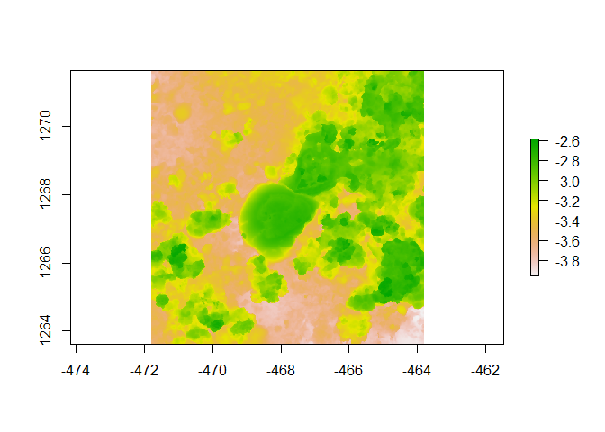

Assignment
================
Andrew Graham
2023-08-24

## R Markdown

``` r
library(raster)
```

    ## Warning: package 'raster' was built under R version 4.2.3

    ## Loading required package: sp

    ## Warning: package 'sp' was built under R version 4.2.3

    ## The legacy packages maptools, rgdal, and rgeos, underpinning the sp package,
    ## which was just loaded, will retire in October 2023.
    ## Please refer to R-spatial evolution reports for details, especially
    ## https://r-spatial.org/r/2023/05/15/evolution4.html.
    ## It may be desirable to make the sf package available;
    ## package maintainers should consider adding sf to Suggests:.
    ## The sp package is now running under evolution status 2
    ##      (status 2 uses the sf package in place of rgdal)

``` r
library(habtools)
```

    ## 
    ## Attaching package: 'habtools'

    ## The following object is masked from 'package:raster':
    ## 
    ##     extent

``` r
library(ggplot2)
```

    ## Warning: package 'ggplot2' was built under R version 4.2.3

``` r
library(dplyr)
```

    ## Warning: package 'dplyr' was built under R version 4.2.3

    ## 
    ## Attaching package: 'dplyr'

    ## The following objects are masked from 'package:raster':
    ## 
    ##     intersect, select, union

    ## The following objects are masked from 'package:stats':
    ## 
    ##     filter, lag

    ## The following objects are masked from 'package:base':
    ## 
    ##     intersect, setdiff, setequal, union

``` r
library(fishualize)
```

    ## Warning: package 'fishualize' was built under R version 4.2.3

``` r
plot(horseshoe)
```

    ## Warning in sp::CRS(...): sf required for evolution_status==2L

    ## Warning in sp::CRS(...): sf required for evolution_status==2L

<!-- --> \###
About me

### Current Lab

Coral Reef Ecology Lab and Cynthia Hunter Lab

### Project focus

Assessment and monitoring of coral reefs statewide and field and
mesocosm experiments. Masters thesis on how fish flight initiation
distance is affected by coral reef rugosity

### Why you chose this course

Interested in learning how coral reef structure affects the populations
that live in it

### What do you want to learn about the most in this course

Coral rugosity measurement methodology

### Your R experience

Low, Introduced to R last Fall with no prior experience. Class focused
on project specific stats with little else

### Fun Fact

I love to spearfish and freedive in my free time.
